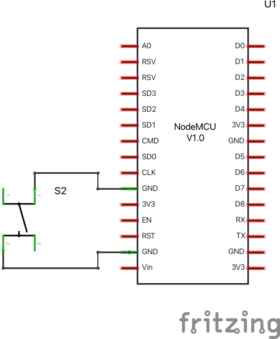

# MQTT Button

In this example we connect to the MQTT server (topic hmm-inc) and wait for a button press. When the button is pressed we send the message `<client_id>:emoji:woof`. The livestreaming server listens for these messages and will respond by displaying the emote by that name. <client_id> is the unique id that you define in the sketch.

There are comment in the code, also included below, that describe how this works. 

Wire the button between pin D27 and GND on the arduino. In the images below you see how this should look on a breadboard and what it looks like as a circuit diagram. 




```c
#include <WiFi.h>
#include <MQTT.h>
#include <ArduinoJson.h>

char ssid[] = "wifi network name";  // Replace with your network SSID
char pass[] = "wifi password";  // Replace with your network password
char host[] = "test.mosquitto.org"; // don't change this.
char topic[] = "inc-hmm"; // don't change this.
String client_id = "esp1"; // but please change this :)

WiFiClient wifiClient;
MQTTClient client;

#define BTN_PIN 27

/*
Setup get run when the ESP32 starts up. 
*/
void setup() {
  Serial.begin(115200); // serial communication for debugging
  pinMode(BTN_PIN, INPUT_PULLUP); // configure pin 27 as an input.
	// we're using INPUT_PULLUP mode, this makes connecting a button 
	// very easy. No resistors needed. 
	// More info: https://roboticsbackend.com/arduino-input_pullup-pinmode/ 

  // start wifi and mqtt
  WiFi.begin(ssid, pass);
  client.begin(host, wifiClient);
  client.onMessage(messageReceived); // call the messageReceived function when a message is received
	// connect wifi and mqtt
  connectWifi();
  connectMqtt();
	// say hi
  sendMessage("connect");
}
  
/*
* The loop function continuously check for new MQTT messages
* 
*/
void loop() {
  client.loop();
  // check if connected to the MQTT relay server
  if (!client.connected()) {
    Serial.println("lost connection");
    connectMqtt();
    delay(5000); // prevent flooding the server
  }
  digitalWrite(LED_BUILTIN, LOW);    // turn the LED off by making the voltage LOW
  if ( digitalRead( BTN_PIN  ) == LOW ) { // if the button is pressed it will read as LOW here
    digitalWrite(LED_BUILTIN, HIGH);   // turn the LED on (HIGH is the voltage level)
    sendMessage("emoji", "woof"); // send the message
    delay(200); // debounce the button and prevent flooding the server.
  }
}


/* ---------------------- you can ignore code below this line --------------------- */

/* 
* Wait for wifi connection 
*/
void connectWifi() {
  Serial.print("Connecting to wifi...");
  while (WiFi.status() != WL_CONNECTED) {
    Serial.print(".");
    delay(1000);
  }
  Serial.println("\nWifi connected!");
  delay(1000);
}

/* 
* Wait for MQTT connection and subscribe to the topic
*/
void connectMqtt() {
  Serial.print("\nConnecting to MQTT server...");
  while (!client.connect(client_id.c_str())) {
    Serial.print(".");
    delay(1000);
  }
  Serial.println("\nMQTT connected!");
  delay(1000);
  client.subscribe(topic);
}

/* 
* In this example we're only sending, but recieved messages
* would be handled by this method.
*/
void messageReceived(String &topic, String &payload) {
  Serial.println(topic + ": " + payload);
  // we're only sending in this example, so nothing happens here.
}


/* 
* Concat the command and parameter into a colon separated string 
* and publish the message 
*/
void sendMessage(String message, String parameter) {
  String msg = client_id + ":" + message + ":" + parameter;
  client.publish(topic, msg);
}

/* 
* Overloaded sendMessage function without the parameter 
*/
void sendMessage(String message) {
  sendMessage(message, "");
}
```