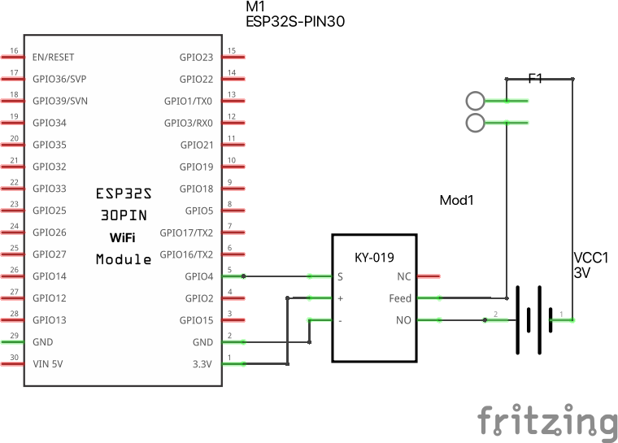

# MQTT Relay

In this last example we hook up a relay to the ESP32 module. A relay is an electrically operated switch. We can use this to turn regular electronic devices on or off.

The ESP32 module connects to the MQTT server (topic hmm-inc) and waits for the command:
`server:relay:on`. When this message is recieved the relay turns on for 3 seconds.

There are comment in the code, also included below, that describe how this works. 

Wire the led between pin D26 and GND on the arduino. In the images below you see how this should look on a breadboard and what it looks like as a circuit diagram. 

