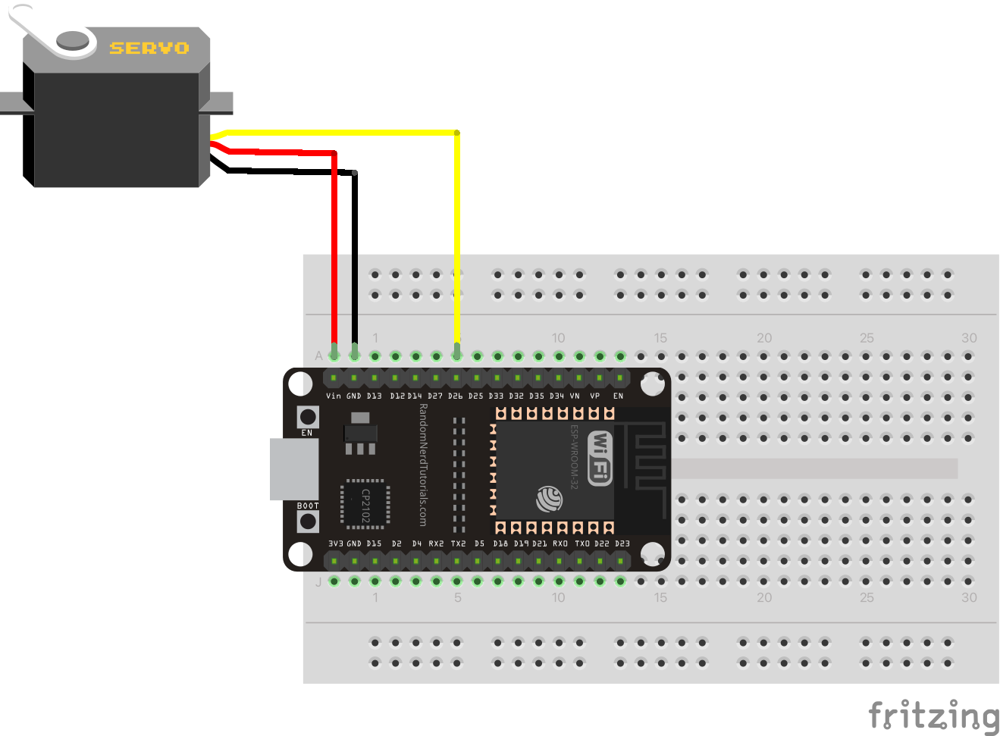
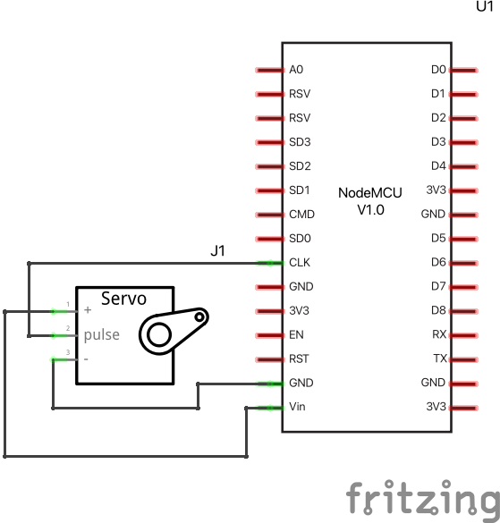

# MQTT Servo

A servo is a motor that can be controlled to rotate from 0 to 180 degrees and anywhere in between. The message send from the live streaming platform controls the servo. 

The ESP32 module connects to the MQTT server (topic hmm-inc) and waits for the command:
`server:servo:x`. Where `x` is the angle the servo should rotate too. `x` should be between 0 and 180 degrees.

There are comment in the code, also included below, that describe how this works. 

The servo needs 5V to operate, we use an external 5V source for this. It could be a powerbank, USB charger or your computer. Wire the 5V wire directly to the servo (red). The ground/minus wire of the power supply goes to BOTH the servo ground (black) and the ESP32 ground. The servo signal wire (yellow or orange) goes to ESP32 D26. In the images below you see how this should look on a breadboard and what it looks like as a circuit diagram. 

