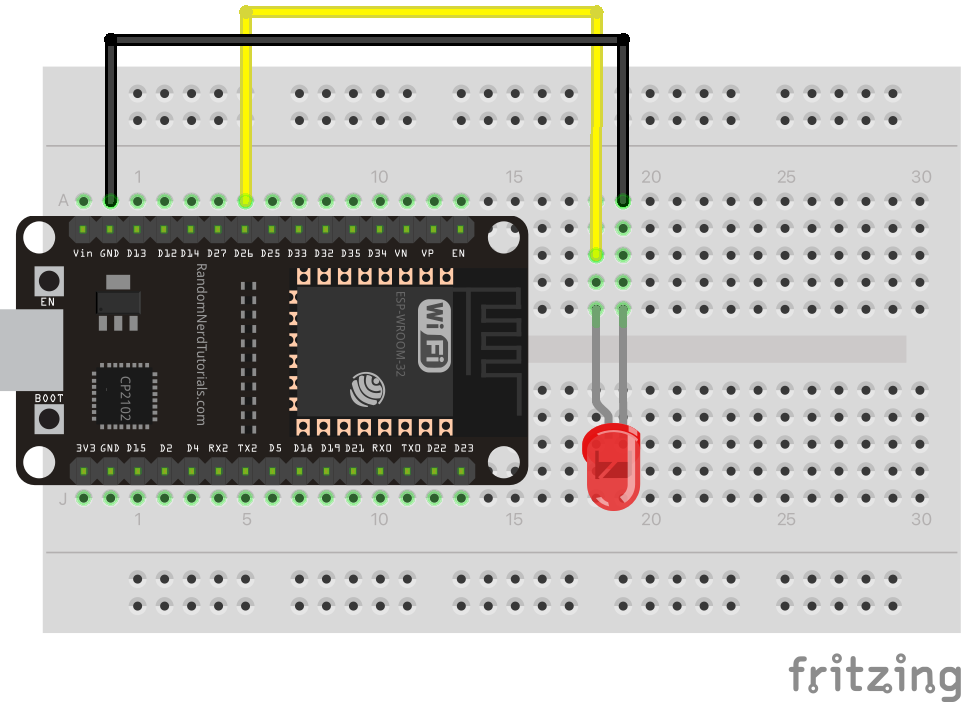

# MQTT Led

In this example we connect to the MQTT server (topic hmm-inc) and wait for the command:
`server:led:on`. There are comment in the code, also included below, that describe how this works. 

Wire the led between pin D26 and GND on the arduino. In the images below you see how this should look on a breadboard and what it looks like as a circuit diagram. 




## Required libraries

Install via Arduino IDE
> Sketch > Include Library.... > Library manager

Then you can search for these and install them:

>>
>>
>>
>>

## Code example

```c
#include <WiFi.h>
#include <MQTT.h>
// Install this library by going to menu Sketch > Include Libary > Manage Libraries...
// Search for ArduinoJson and click Install.
#include <ArduinoJson.h>
// Install this library by going to menu Sketch > Include Libary > Manage Libraries...
// Search for StringSplitter and click Install.
#include "StringSplitter.h" 

char ssid[] = "Yellow Submarine";  // Replace with your network SSID
char pass[] = "@chterhoek!";  // Replace with your network password
char host[] = "test.mosquitto.org"; // don't change this.
char topic[] = "inc-hmm"; // don't change this.
String client_id = "esp1"; // but please DO change this :)

WiFiClient wifiClient;
MQTTClient client;

#define LED_PIN 26

/*
Setup get run when the ESP32 starts up. 
*/
void setup() {
  Serial.begin(115200); // serial communication for debugging
  pinMode(LED_PIN, OUTPUT); // configure pin 26 as a output. 

  // start wifi and mqtt
  WiFi.begin(ssid, pass);
  client.begin(host, wifiClient);
  client.onMessage(messageReceived); // call the messageReceived function when a message is received
	// connect wifi and mqtt
  connectWifi(); 
  connectMqtt();
	// say hi
  sendMessage("connect");
}

/*
* The loop function continuously check for new MQTT messages
*/
void loop() {
  client.loop();
  // check if connected to the MQTT relay server
  if (!client.connected()) {
    Serial.println("lost connection");
    connectMqtt();
  }
}

/*	
* This is where the real work happens...
* This function is called when we receive a message over MQTT.
* Each message is formatted like this: 
* `origin:command:parameter`
* `origin` is the sender, here we're looking for messages received from `server`.
* `command` is the command to be executed, in this example it's the command `led` we're waiting for.
* `parameter` can contain extra information, here it can be `on` to turn the led on and anything else in the 
* parameter will turn the led off.
*/
void messageReceived(String &topic, String &payload) {
  Serial.println(topic + ": " + payload);
  
  StringSplitter *splitter = new StringSplitter(payload, ':', 3);
  int itemCount = splitter->getItemCount();

  if ( itemCount == 3 ){ // we have properly formatted command
    String origin = splitter->getItemAtIndex(0);
    String command = splitter->getItemAtIndex(1);
    String parameter = splitter->getItemAtIndex(2);

    if( origin == "server" ){
      if( command == "led" ) {
        if ( parameter == "on" ){
          digitalWrite( LED_PIN, HIGH );
        } else {
          digitalWrite( LED_PIN, LOW );
        }
      }
    }
  }
}

/* ---------------------- you can ignore code below this line --------------------- */

/* 
* Wait for wifi connection 
*/
void connectWifi() {
  Serial.print("Connecting to wifi...");
  while (WiFi.status() != WL_CONNECTED) {
    Serial.print(".");
    delay(1000);
  }
  Serial.println("\nWifi connected!");
  delay(1000);
}

/* 
* Wait for MQTT connection and subscribe to the topic
*/
void connectMqtt() {
  Serial.print("\nConnecting to MQTT server...");
  while (!client.connect(client_id.c_str())) {
    Serial.print(".");
    delay(1000);
  }
  Serial.println("\nMQTT connected!");
  delay(1000);
  client.subscribe(topic);
}

/* 
* Concat the command and parameter into a colon separated string 
* and publish the message 
*/
void sendMessage(String message, String parameter) {
  String msg = client_id + ":" + message + ":" + parameter;
  client.publish(topic, msg);
}

/* 
* Overloaded sendMessage function without the parameter 
*/
void sendMessage(String message) {
  sendMessage(message, "");
}
```