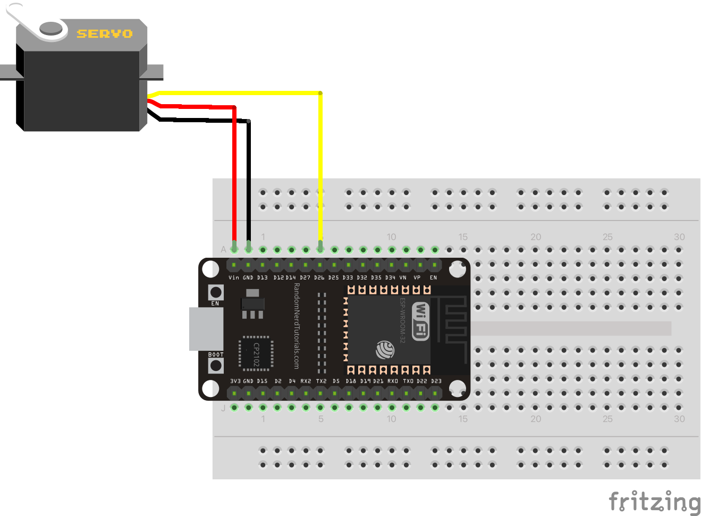
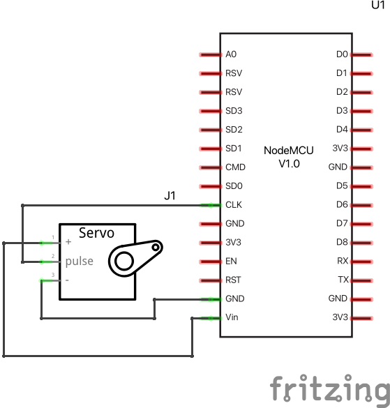
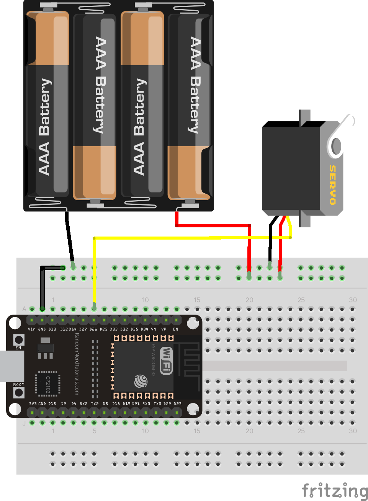
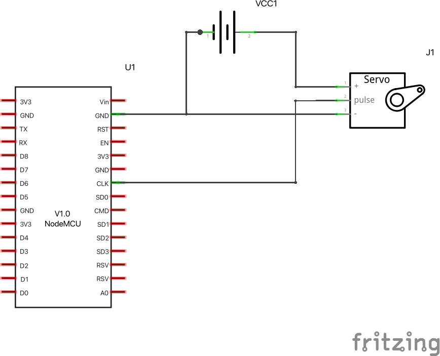

# MQTT Servo

*For this example you need to install the ServoESP32 library!*

A servo is a motor that can be controlled to rotate from 0 to 180 degrees and anywhere in between. The message send from the live streaming platform controls the servo. 

The ESP32 module connects to the MQTT server (topic hmm-inc) and waits for the command:
`server:servo:x`. Where `x` is the angle the servo should rotate too. `x` should be between 0 and 180 degrees.

There are comment in the code, also included below, that describe how this works. 

## Chat messages + parameters Servo


You can send these commands to move the arm of the servo. It has a range of 0-180 degrees. So 0 would be extreme left, 90 is in the middle, and 180 is extreme right. Any numbers in between will also work.

* `/servo:0`
* `/servo:90`
* `/servo:180`

## simple setup

Connect the servo as shown below. 

| Item         | Servo       | ESP32 |
|--------------|-------------|-------|
| 5V           | Red wire    | Vin   |
| GND          | Brown wire  | GND   |
| Servo signal | Orange wire | D26   |




## Required libraries

Install via Arduino IDE
> Sketch > Include Library.... > Library manager

Then you can search for these and install them:

>>
>>
>>
>>

More info and examples about the servo library [here](https://www.arduino.cc/reference/en/libraries/servo/)


## Troubleshooting

The servo uses a lot of energy, maybe more than the ESP32 can supply. This may cause errors (brown-outs).
We can use an external 5V source to power the servo. It could be batteries (as in the image below), a powerbank, USB charger or your computer. Wire the 5V wire directly to the servo (red servo wire). The ground/minus wire of the power supply goes to BOTH the servo ground (brown servo wire) and the ESP32 ground. The servo signal wire (orange) goes to ESP32 D26. In the images below you see how this should look on a breadboard and what it looks like as a circuit diagram. 




## Code example

```arduino
#include <WiFi.h>
#include <MQTT.h>
#include <ArduinoJson.h>
// Install this library by going to menu Sketch > Include Libary > Manage Libraries...
// Search for ServoESP32 and click Install.
#include <Servo.h>
// Install this library by going to menu Sketch > Include Libary > Manage Libraries...
// Search for StringSplitter and click Install.
#include "StringSplitter.h"

char ssid[] = "wifi network name";  // Replace with your network SSID
char pass[] = "wifi password";      // Replace with your network password
char host[] = "test.mosquitto.org"; // don't change this.
char topic[] = "inc-hmm";						// don't change this.
String client_id = "esp1";					// but please DO change this :)

WiFiClient wifiClient;
MQTTClient client;

#define SERVO_PIN 26  // connect the signal pin of your servo to pin 26

int currentPos = 90;       // variable to save current position of servo arm
int goalPos = 90;          // variable to save goal position of servo arm (coming from chat user)


Servo servo;

void setup()
{
  Serial.begin(115200);				// serial communication for debugging
  servo.attach(SERVO_PIN); // configure pin 26 for a servo signal.
  servo.write(90);

  // start wifi and mqtt
  WiFi.begin(ssid, pass);
  client.begin(host, wifiClient);
  client.onMessage(messageReceived); // call the messageReceived function when a message is received
  // connect wifi and mqtt
  connectWifi();
  connectMqtt();
  // say hi
  sendMessage("connect");
}

/*
   The loop function continuously check for new MQTT messages
*/
void loop()
{
  client.loop();
  // check if connected to the MQTT relay server
  if (!client.connected())
  {
    Serial.println("lost connection");
    connectMqtt();
    delay(5000); // prevent flooding the server
  }

  if (goalPos < currentPos) {           // if currentPos is higher than goalPos...
    currentPos--;                       // decrement by 1
    servo.write(currentPos);            // update servo arm with new position
  } else if (goalPos > currentPos) {    // if currentPos is lower than goalPos...
    currentPos++;                       // increment by 1
    servo.write(currentPos);            // update servo arm with new position
  }
  //  Serial.print("currentPos: ");
  //  Serial.print(currentPos);
  //  Serial.print( " goalPos: ");
  //  Serial.println(goalPos);
  delay(100);
}

/*
   The messageReceived function is called when we receive a message over MQTT.
   Each message is formatted like this:
   `origin:command:parameter`
   `origin` is the sender, here we're looking for messages received from `server`.
   `command` is the command to be executed, in this example it's the command `servo` we're waiting for.
   `parameter` can contain extra information, here it can be a number between 0 and 180.
              and is the angle the servo should rotate to.
*/
void messageReceived(String &topic, String &payload)
{
  Serial.println(topic + ": " + payload);

  StringSplitter *splitter = new StringSplitter(payload, ':', 3);
  int itemCount = splitter->getItemCount();

  if (itemCount == 3)
  { // we have properly formatted command
    String origin = splitter->getItemAtIndex(0);
    String command = splitter->getItemAtIndex(1);
    String parameter = splitter->getItemAtIndex(2);

    if (origin == "server")
    {
      if (command == "servo")
      {
        goalPos = parameter.toInt();  // update value to store new angle command coming from chat
        goalPos = constrain( goalPos, 0, 180);
        Serial.print("Rotate to: ");
        Serial.println(goalPos);
      }
    }
  }
}

/* ---------------------- you can ignore code below this line --------------------- */

/*
   Wait for wifi connection
*/
void connectWifi()
{
  Serial.print("Connecting to wifi...");
  while (WiFi.status() != WL_CONNECTED)
  {
    Serial.print(".");
    delay(1000);
  }
  Serial.println("\nWifi connected!");
  delay(1000);
}

/*
   Wait for MQTT connection and subscribe to the topic
*/
void connectMqtt()
{
  Serial.print("\nConnecting to MQTT server...");
  while (!client.connect(client_id.c_str()))
  {
    Serial.print(".");
    delay(1000);
  }
  Serial.println("\nMQTT connected!");
  delay(1000);
  client.subscribe(topic);
}

/*
   Concat the command and parameter into a colon separated string
   and publish the message
*/
void sendMessage(String message, String parameter)
{
  String msg = client_id + ":" + message + ":" + parameter;
  client.publish(topic, msg);
}

/*
   Overloaded sendMessage function without the parameter
*/
void sendMessage(String message)
{
  sendMessage(message, "");
}

```