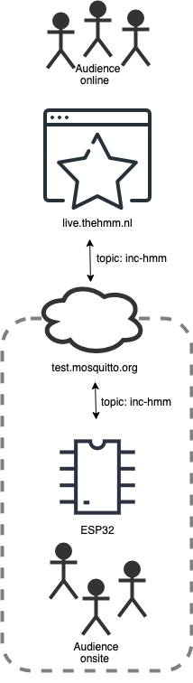

# Emoji Proxies & Ghost Messengers

## Introduction

How can online visitors of cultural events feel seen, become more involved in or even have agency over what happens on-site? That is the central question during this workshop. To facilitate experimentation during this workshop we’ve developed a few prototypes or starting points. Each prototype uses an ESP32 module to communicate with the The Hmm live streaming platform. ESP32 is a hardware module that makes it relatively easy to connect buttons, lights and other electronics to a website. The diagram below illustrates how the module communicates with the live streaming platform. 



Both the live streaming server and the ESP32 module are connected over the MQTT protocol with an open MQTT server, and are able to send and receive messages. The online audience can send messages in the chat that will be forwarded to the ESP32 module and the ESP32 can do the reverse. 

### Examples 

We’ve developed a few examples that might function as a starting point for experimentation. Each example has more detailed instructions inside. 

1.	[Led](Code/MQTT_led/) - A led is connected to the ESP32 module. When the online audience types a specific message in the chat the led will light up. So the interaction in this example is from online audience to the onsite audience. 
2.	[Button](Code/MQTT_button/)  - In this first example we connect a button to the module. When the button is pressed a message is sent to the live streaming server. If the server receives this message it will show a specific emote. This allows the physical audience to interact with the audience on the live streaming platform. 
3.	[Neopixel](Code/MQTT_neopixel/)  - This example is more elaborate variation on the first example. A specifically crafted message on the live streaming platform can set the color of a led connected to the ESP32.
4.	[Relay](Code/MQTT_relay/)  - By connecting a relay (an electrically operated switch) we can turn on (and off) almost any device. Here we’ve connected a wacky flailing inflatable tube man. 

### Breadboard

To prototype we will be using a breadboard. 


* https://learn.adafruit.com/lesson-0-getting-started/breadboard


## Installation

In this workshop we'll use a few pre-prepared computers, but if you'd like to continue on your own machine follow the steps below.

1. Download and install the Arduino IDE
2. Install the ESP32 board
3. Install the drivers
4. Install the needed libraries

We've documented the installation process on the [Hackers & Designers wiki](https://wiki.hackersanddesigners.nl/index.php?title=ESP32_Arduino_Setup).
Follow the steps on the linked page, but instead of installing the libraries mentioned in the article, install the libraries below. **`REPLACE STEP 5`** with these instructions:

1. Open the library manager by going to the menu `Sketch` > `Include Library` > `Manage Libraries...`
2. In the search field type: MQTT, scroll down until you find a library simply called MQTT by Joel Gaehwiller. Click in the install button and wait for the download to finish. Do not close the library manager.
3. Install ArduinoJson in the same way as the previous step.
4. Lastly, also install the library called StringSplitter.
4. Now continue with step 6 in the article, but replace the code with this:
```c
#include <MQTT.h>

void setup() {
}

void loop() {
}  
```
