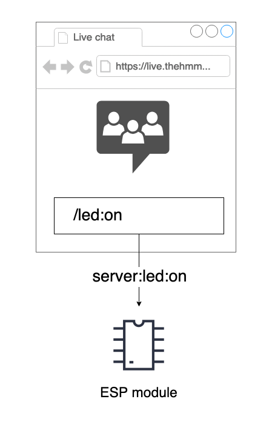
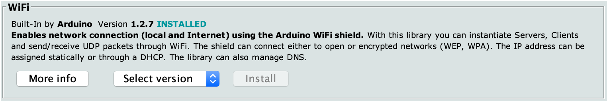
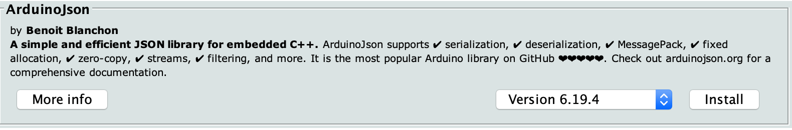
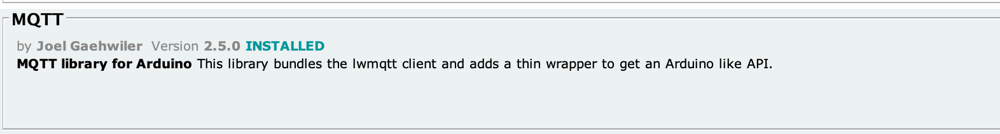
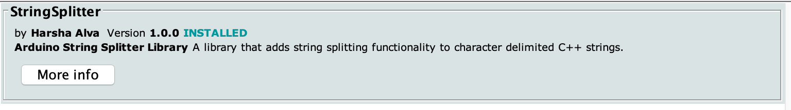
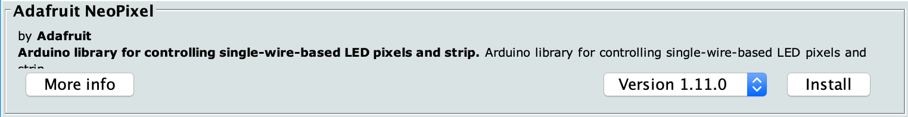
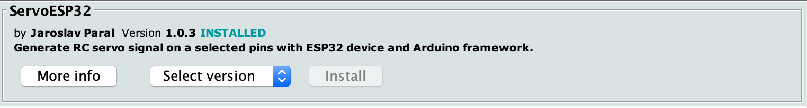

# Emoji Proxies & Ghost Messengers

# Workshop Framer Framed

Livestream link: https://live.thehmm.karls.computer/emoji-proxies-boo-2   
Etherpad: TBD


## Introduction

How can online visitors of cultural events feel seen, become more involved in or even have agency over what happens on-site? That is the central question during this workshop. To facilitate experimentation during this workshop we’ve developed a few prototypes or starting points. Each prototype uses an ESP32 module to communicate with the The Hmm live streaming platform. ESP32 is a hardware module that makes it relatively easy to connect buttons, lights and other electronics to a website. The diagram below illustrates how the module communicates with the live streaming platform. 

## Examples 

We’ve developed a few examples that might function as a starting point for experimentation. Each example has more detailed instructions inside for the code, libraries, a wiring diagram and a breadboard view.

**Client ID**: Please change the client_id in the sketch to something unique, so that each device has its own id!

1.	[Led](Code/MQTT_led/) - A led is connected to the ESP32 module. When the online audience types a specific message in the chat the led will light up. So the interaction in this example is from online audience to the onsite audience. 
2.	[Neopixel](Code/MQTT_neopixel/)  - This example is more elaborate variation on the first example. A specifically crafted message on the live streaming platform can set the color of a led connected to the ESP32.
3.	[Relay](Code/MQTT_relay/)  - By connecting a relay (an electrically operated switch) we can turn on (and off) almost any device. Here we’ve connected a wacky flailing inflatable tube man. 
4.	[Servo](Code/MQTT_servo/)  - A servo is a motor that can be controlled to rotate from 0 to 180 degrees and anywhere in between. The message send from the live streaming platform controls the servo. 

For reference, the last example shows how to connect a button. Since we're focussing on communication from the live stream to the physical space in this workshop we're not going to go too deep into this. 

5.	[Button](Code/MQTT_button/)  - In this first example we connect a button to the module. When the button is pressed a message is sent to the live streaming server. If the server receives this message it will show a specific emote. This allows the physical audience to interact with the audience on the live streaming platform. 


## Communication


Both the live streaming server and the ESP32 module are connected over the MQTT protocol with an open MQTT server, and are able to send and receive messages. The online audience can send messages in the chat that will be forwarded to the ESP32 module and the ESP32 can do the reverse. 

## Message format

### In the ESP32 module code:

In the code the messageReceived function is called when we receive a message over MQTT.
Each message is formatted like this: `origin:command:parameter`

* `origin` is the 'name' of the sender, this will be 'server' if the message originates from the server, otherwise the name that is set in the `client_id` string in the sketch.
* `command` is the command to be executed. You can find per example commands in their respective .ino files.

* `parameter` can contain extra information, for example 'on' to turn a led on, or a color for the led strip example.

The examples contain code to split the message string into its constituent parts.

For example: the servo example has the `command` **servo** with a number as a `parameter`. The parameter will deceide how much the servo rotates. 

### In the Livestream chat

Messages sent in the livestream chat from the online audience are recieved by the livestream server and forwarded over to the ESP32 devices in the physical space. The proper way to send commands to the ESP32 modules in the livestream chat is with the format `/command:parameter`, for example: `/led:on`. For messages recieved from the chat, the `origin` is always the server, so the previous message would be received by the module as `server:led:on`.



The corresponding code in the sketch on the ESP32, looks like this:

```arduino
if( command == "led" ) {
	if ( parameter == "on" ){
		digitalWrite( LED_PIN, HIGH );
	} else {
		digitalWrite( LED_PIN, LOW );
	}
}
```
Since all commands (messages starting with a slash in the chat) get forwarded to the ESP32, you can easily add your own commands. IE, change "led" to "light" in the code above, and the command ```/led:on``` will turn on the led.

## Installation

In this workshop we'll use a few pre-prepared computers, but if you'd like to continue on your own machine follow the steps below.

1. Download and install the Arduino IDE
2. Install the ESP32 board
3. Install the drivers
4. Install the needed libraries

We've documented the installation process on the [Hackers & Designers wiki](https://wiki.hackersanddesigners.nl/index.php?title=ESP32_Arduino_Setup).
Follow the steps on the linked page, but instead of installing the libraries mentioned in the article, install the libraries we need for the examples. To do that **`REPLACE STEP 5`** with these instructions:

1. Open the library manager by going to the menu `Sketch` > `Include Library` > `Manage Libraries...`
2. In the search field type: MQTT, scroll down until you find a library simply called MQTT by Joel Gaehwiller. Click in the install button and wait for the download to finish. Do not close the library manager.
3. Install `ArduinoJson`, `Adafruit Neopixel` and `StringSplitter` in the same way as the previous step (see images below for reference)
5. Now continue with step 6 in the article, but replace the code with this:
```c
#include <MQTT.h>
#include <ArduinoJson.h>
#include <Adafruit_NeoPixel.h>
#include <StringSplitter.h>

void setup() {
}

void loop() {
}  
```
Press the verify button in the IDE (check mark, top left). If the code compiles without errors, you're all set.

**For all examples**

>>
>>
>>

**For the LED & relay examples**

>>

**For the neopixel example**

>>

**For the servo example**

>>


### Message format

#### In the ESP32 module code

In the code the messageReceived function is called when we receive a message over MQTT.
Each message is formatted like this: `origin:command:parameter`

* `origin` is the 'name' of the sender, this will be 'server' if the message originates from the server, otherwise the name that is set in the `client_id` string in the sketch.
* `command` is the command to be executed. You can find per example commands in their respective .ino files.

* `parameter` can contain extra information, for example 'on' to turn a led on, or a color for the led strip example.

The examples contain code to split the message string into its constituent parts.

#### In the Livestream chat

Messages sent in the livestream chat from the online audience are recieved by the livestream server and forwarded over to the ESP32 devices in the physical space. The proper way to send commands to the ESP32 modules in the livestream chat is with the format `/command:parameter`, for example: `/led:on`. For messages recieved from the chat, the `origin` is always the server, so the previous message would be received by the module as `server:led:on`.


**Chat messages + parameters LED**

* `/led:on`
* `/led:off`


**Chat messages + parameters Neopixel**

The command is *rgb* and the parameter is a hexidecimal value that represents a color code. Use a color picker to find hexidecimal color codes (they start with a #)

e.g.

* `/rgb:#ff33f6`

You can use a tool to pick a color, it will give you the hexidecimal number you can include in the code: [HTML color codes](https://htmlcolorcodes.com/)

**Chat messages + parameters Relay**

In the example only an ON state is described. The relay will turn on for 3 seconds and automatically turns off. 

* `/relay:on`

**Chat messages + parameters Servo** 

You can send these commands to move the arm of the servo. It has a range of 0-180 degrees. So 0 would be extreme left, 90 is in the middle, and 180 is extreme right. Any numbers in between will also work.

* `/servo:0`
* `/servo:90`
* `/servo:180`


### Breadboard

To build our prototypes we will be using a solderless breadboard. This is a little plastic board with holes in it. These holes let you easily insert electronic components to quickly test an electronic circuit without having to solder. There's more information on breadboards and how to use them on the links below the image.


* https://www.sciencebuddies.org/science-fair-projects/references/how-to-use-a-breadboard
* https://learn.adafruit.com/lesson-0-getting-started/breadboard

## License

Everything in this repo is licensed under the CC4r * COLLECTIVE CONDITIONS FOR RE-USE license.
Copyleft Attitude with a difference - version 1.0

[CC4r](https://constantvzw.org/wefts/cc4r.en.html)
